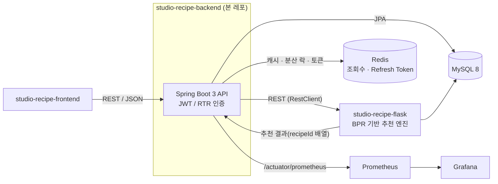
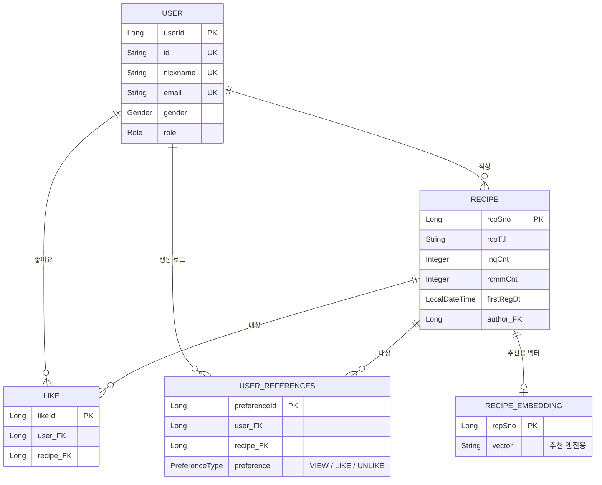

# 🍳 Studio Recipe — Backend

음식 재료/조리법 기반 **레시피 추천 서비스**의 백엔드 API 서버입니다. Spring Boot 기반 REST API 서버로, 별도 레포로 분리된 **Flask 추천 엔진**과 통신해 사용자 맞춤 레시피를 추천하고, 부하테스트로 실제 트래픽을 통해 병목현상을 발견하고 문제를 수치화하고 개선한 경험을 정리한 프로젝트입니다.

> 3개 저장소로 구성된 organization(`studio-recipe`)의 백엔드 레포입니다. 전체 구조는 [연관 레포지토리](#-연관-레포지토리) 참고.

<br>

## 📑 목차

- [아키텍처](#-아키텍처)
- [기술 스택](#-기술-스택)
- [핵심 기능](#-핵심-기능)
- [기술적 도전과 해결](#-기술적-도전과-해결)
  - [1. 인덱스 튜닝으로 메인 페이지 조회 성능 개선](#1-인덱스-튜닝으로-메인-페이지-조회-성능-개선)
  - [2. Redis Write-Behind 전략으로 조회수 집계 분리](#2-redis-write-behind-전략으로-조회수-집계-분리)
  - [3. Refresh Token Rotation + Grace Period](#3-refresh-token-rotation--grace-period)
  - [4. 동시성 버그 재현 테스트](#4-동시성-버그-재현-테스트)
- [도메인 모델](#-도메인-모델)
- [API 문서](#-api-문서)
- [로컬 실행 방법](#-로컬-실행-방법)
- [프로젝트 구조](#-프로젝트-구조)
- [테스트](#-테스트)
- [모니터링](#-모니터링)
- [연관 레포지토리](#-연관-레포지토리)

<br>

## 🏗 아키텍처



- **backend(본 레포)** 는 인증, 레시피 CRUD, 좋아요, 조회수 집계, 관리자 지표를 담당하는 API 서버입니다.
- 추천 로직 자체(BPR 모델 학습/추론)는 **flask** 서버에 위임하고, backend는 추천된 `recipeId` 목록을 받아 DB 조회 후 응답을 조립합니다.
- Redis는 캐시 용도가 아니라 **조회수 배치 집계**, **Refresh Token 저장/회전**, **분산 락**의 인프라로 사용됩니다.

<br>

## 🛠 기술 스택

| 분류 | 스택 |
|---|---|
| Language / Framework | Java 17, Spring Boot 3.5.5 |
| 인증 | Spring Security, JWT (jjwt 0.11.5), Refresh Token Rotation |
| Data | MySQL 8, Spring Data JPA, Redis 6 |
| 외부 연동 | Flask 추천 엔진 (Spring `RestClient`) |
| 문서화 | springdoc-openapi (Swagger UI) |
| 모니터링 | Spring Actuator, Micrometer, Prometheus, Grafana |
| 테스트 | JUnit 5, Testcontainers(MySQL), k6 (부하 테스트) |
| 인프라 | Docker, Docker Compose |

<br>

## ✨ 핵심 기능

**인증 / 회원**
- 회원가입, 로그인, 아이디/닉네임 중복 확인
- 이메일 인증번호 발송·검증 (Spring Mail)
- 아이디 찾기, 비밀번호 재설정 (1회성 토큰 기반)
- Access/Refresh Token 발급 및 **RTR(Refresh Token Rotation)** 재발급, 로그아웃

**레시피**
- 메인 페이지 목록 조회 (페이징/정렬)
- 레시피 상세 조회 (조회수 자동 집계)
- 레시피 등록/수정/삭제 (본인 소유만, 이미지 업로드 포함)
- 좋아요 등록/취소, 좋아요 내역 조회
- 사용자 맞춤 추천 (Flask 연동)

**관리자**
- 추천 지표(Recall@10, nDCG@10, Hit Rate@10, Coverage) 조회/재계산
- BPR 모델 재학습 트리거 및 학습 상태 조회

<br>

## 🔧 기술적 도전과 해결

단순 기능 구현이 아니라 **문제를 재현 → 원인 분석 → 해결 → 재측정**한 흐름을 남겼습니다.

### 1. 인덱스 튜닝으로 메인 페이지 조회 성능 개선

메인 페이지는 `RecipeService.readRecipePage()` → `findAll(Pageable)` → `ORDER BY FIRST_REG_DT DESC LIMIT` 로 최신순 정렬됩니다. 인덱스가 없으면 매 요청마다 풀 테이블 스캔 + filesort가 발생하는 것을 `EXPLAIN`으로 확인하고, k6로 300VU 부하 상황을 재현해 before/after를 직접 측정했습니다.

**측정 방법(재현 가능)**
1. `idx_recipes_first_reg_dt` 인덱스 제거 → `EXPLAIN` 결과 `type: ALL`, `Extra: Using filesort` 확인
2. k6로 300VU 부하 테스트 실행 (`k6/springboot_load_test.js`, `--summary-export`)
3. `CREATE INDEX idx_recipes_first_reg_dt ON recipes (first_reg_dt)` 로 재생성 → `EXPLAIN` 결과 `type: index`, `Backward index scan` 확인
4. 동일 시나리오로 k6 재실행, 결과 비교

**결과 (300VU 부하 기준)**

| 지표 | Before | After | 개선율 |
|---|---:|---:|---:|
| 메인 페이지 평균 응답 | 96.2ms | 55.0ms | **-42.9%** |
| 메인 페이지 P95 | 381.1ms | 272.0ms | **-28.6%** |
| 메인 페이지 최대 응답 | 1299.2ms | 541.6ms | **-58.3%** |
| 전체 처리량(req/s) | 96.5 | 108.3 | **+12.2%** |
| 상세 페이지 P95 (부가 효과) | 53.6ms | 25.9ms | -51.6% |

> 추천 API(`recommend_duration`, P95 약 3.0초)는 이 인덱스와 무관하게 **Flask 추천 엔진 자체가 300VU에서 병목**이라 개선되지 않았습니다. 원인이 다른 컴포넌트에 있다는 것을 명확히 하고, 이 케이스의 개선 범위를 메인/상세 조회로 한정해 정리했습니다.

<br>

### 2. Redis Write-Behind 전략으로 조회수 집계 분리

레시피 상세 조회마다 `RECIPES.INQ_CNT`를 직접 `UPDATE`하면 인기 레시피에 쓰기 경합이 집중됩니다. 대신 조회는 Redis 카운터(`view:{recipeId}`)만 증가시키고, 상세 응답 시 **DB 저장값 + Redis 누적값**을 합산해 반환합니다. 별도 스케줄러(`@Scheduled(fixedDelay = 60000)`)가 60초 주기로 Redis 값을 DB에 반영(flush)합니다.

- 서버가 여러 대여도 한 번에 한 인스턴스만 flush 하도록 **Redis 분산 락**(`SETNX` + Lua release script)으로 제어
- 레시피 1건 = 트랜잭션 1건으로 분리해, 한 건의 DB 반영 실패가 다른 레시피에 영향을 주지 않도록 격리
- **DB 커밋이 확정된 뒤에만** Redis 값을 차감 → 커밋 실패 시 값이 그대로 남아 다음 주기에 자동 재시도 (조회수 영구 유실 방지)

이 설계에서 발생할 수 있는 경합/유실 케이스는 아래 [동시성 버그 재현 테스트](#4-동시성-버그-재현-테스트)에서 직접 재현하고 검증했습니다.

<br>

### 3. Refresh Token Rotation + Grace Period

Refresh Token 재사용 탐지를 위해 재발급 시마다 토큰을 회전(RTR)시킵니다. 문제는 **프론트에서 동시에 여러 요청이 401을 맞아 짧은 시간차로 재발급을 호출하는 경우**, 정상 사용자인데도 이미 회전되어 폐기된 토큰이 재사용된 것으로 오탐되어 세션이 끊기는 문제가 있었습니다.

`RefreshTokenService`에서 "현재 값 조회 → 제시된 토큰 비교 → 회전/유예 판정 → 기록"을 **Lua 스크립트 하나로 원자적으로 처리**해 해결했습니다.

| 판정 | 조건 | 처리 |
|---|---|---|
| `ROTATED` | 제시된 토큰이 현재 값과 일치 | 새 토큰으로 회전, 이전 값은 5초간 `GRACE` 키로 유예 저장 |
| `GRACE` | 제시된 토큰이 유예 기간(5초) 내 옛 값과 일치 | 세션 유지, 이미 회전된 현재 토큰을 그대로 반환 |
| `REUSE_DETECTED` | 현재/유예 값 어느 쪽과도 불일치 | 탈취로 간주, 세션 즉시 폐기 |
| `NO_SESSION` | 저장된 토큰 없음 | 로그아웃 상태 등으로 처리 |

판단(GET)과 쓰기(SET)를 애플리케이션 레벨에서 분리하면 그 사이에 동시 요청이 끼어들어 서로의 회전 결과를 덮어쓰는 TOCTOU 경합이 생기기 때문에, 반드시 원자적 스크립트로 묶었습니다.

<br>

### 4. 동시성 버그 재현 테스트

"동시성 문제가 있을 것 같다"가 아니라, `Testcontainers` + 멀티스레드로 **실제 버그를 재현하는 테스트**를 먼저 작성하고, 그 테스트가 실패하는 것을 확인한 뒤 수정했습니다.

| 테스트 | 재현 시나리오 | 근본 원인 | 해결 |
|---|---|---|---|
| `RecipeLockContentionTest` | flush가 레시피 row 락을 잡은 동안, 같은 레시피를 수정하려는 사용자 요청이 대기(블로킹)됨 | 웹 요청 트랜잭션과 스케줄러 트랜잭션이 같은 row를 두고 경합 | 레시피 1건 = 트랜잭션 1건으로 쪼개 락 보유 시간을 최소화 |
| `ConcurrentFlushDeadlockTest` | 서버 2대 이상에서 flush가 동시에 겹치는 레시피 2건을 서로 다른 순서로 UPDATE | 교차 순서 UPDATE로 인한 실제 MySQL 데드락 | flush 대상을 `recipeId` 오름차순 정렬 후 순차 처리 → 서버가 몇 대든 항상 같은 lock 획득 순서 보장 |
| `UserReferencesConcurrencyTest` | 같은 (user, recipe) 조합을 동시에 조회하면 중복 row 생성 | check-then-act 로직 + Unique 제약 부재 | `UQ_USER_RECIPE_PREFERENCE` Unique 제약 + `INSERT ... ON DUPLICATE KEY UPDATE` 원자적 upsert로 전환 |
| `ViewCountUndercountWindowTest` | flush가 Redis 값을 `GETDEL` 로 비웠지만 DB 커밋 전인 순간, 다른 스레드가 상세 페이지를 읽으면 조회수가 과소 집계됨 | Redis 삭제와 DB 커밋 사이의 타이밍 윈도우 | DB 커밋이 확정된 뒤에만 Redis 값을 차감하도록 순서 변경 (2번 항목과 동일 원칙) |

> 테스트는 `ContainerSupport`(Testcontainers 기반 MySQL)와 `ConcurrentRunner` 헬퍼를 공유하며, `src/test/java/com/recipe/service` 하위에 있습니다.

<br>

## 🗂 도메인 모델



- `USER_REFERENCES`는 좋아요/조회 등 사용자 행동을 `(user, recipe)` 단위로 기록해 추천 엔진의 학습 데이터로 사용됩니다. `VIEW`는 이미 `LIKE`인 경우 덮어쓰지 않고, `LIKE`/`UNLIKE`는 항상 최신 상태로 반영되는 전이 규칙을 가집니다.
- `RECIPE_EMBEDDING` / `USER_EMBEDDING`, `RECOMMEND_METRICS`는 Flask 추천 엔진과 연동되는 테이블로, 각각 아이템 임베딩과 추천 품질 지표(Recall@10, nDCG@10, Hit Rate@10, Coverage)를 저장합니다.
- 시드 데이터는 약 23,000건의 실제 레시피(`data/recipe_data_241226.csv`)를 사용합니다.

<br>

## 📖 API 문서

애플리케이션 실행 후 아래 경로에서 확인할 수 있습니다.

- Swagger UI: `http://localhost:8080/studio-recipe/swagger-ui/index.html`
- OpenAPI Spec: `http://localhost:8080/studio-recipe/v3/api-docs`

인증이 필요한 API는 `Authorization: Bearer {accessToken}` 헤더를, 재발급/로그아웃은 `Refresh-Token` 헤더를 사용합니다.

<br>

## 🚀 로컬 실행 방법

### 요구사항
- Docker / Docker Compose
- (직접 빌드 시) JDK 17, Gradle Wrapper 포함

### 1. 환경 변수 설정

`.env.example`을 참고해 프로젝트 루트에 `.env` 파일을 만듭니다.

```bash
cp .env.example .env
```

| 변수 | 설명 |
|---|---|
| `DB_DATABASE_NAME` / `DB_ROOT_PASSWORD` / `DB_USERNAME` / `DB_PASSWORD` | MySQL 접속 정보 |
| `JWT_SECRET_KEY` | JWT 서명 키 (Base64) |
| `JWT_ACCESS_TOKEN_VALIDITY_IN_SECONDS` / `JWT_REFRESH_TOKEN_VALIDITY_IN_SECONDS` | 토큰 만료 시간(초) |
| `FLASK_BASE_URL` | 추천 엔진(Flask) 베이스 URL |
| `MAIL_HOST` / `MAIL_PORT` / `MAIL_USERNAME` / `MAIL_PASSWORD` | 이메일 인증 발송용 SMTP 정보 |
| `FRONT_URL` | CORS 허용 프론트엔드 origin |

### 2. 전체 스택 기동

`docker-compose.yml`은 MySQL, Redis, Flask 추천 엔진, 백엔드, Prometheus, Grafana를 한 번에 띄웁니다.

```bash
docker compose up -d
```

| 서비스 | 포트 | 설명 |
|---|---|---|
| backend | 8080 | Spring Boot API (`context-path: /studio-recipe`) |
| flask | 5000 | 추천 엔진 |
| db (MySQL) | 3306 | |
| redis | 6379 | |
| prometheus | 9090 | |
| grafana | 3000 | 기본 계정 `admin` / `admin` |

```bash
# 로그 확인
docker compose logs -f backend

# 종료
docker compose down
```

### 3. 로컬(IDE)에서 백엔드만 실행

MySQL/Redis만 컨테이너로 띄우고 Spring Boot는 IDE에서 직접 실행하려면 `application-local.yml` 프로파일을 사용합니다.

```bash
./gradlew bootRun --args='--spring.profiles.active=local'
```

<br>

## 📁 프로젝트 구조

```
recipe/
├── src/main/java/com/recipe
│   ├── config/           # Security, JWT, Redis, CORS, Swagger, WebMvc 설정
│   ├── controller/        # REST 컨트롤러 (auth / recipe / like / user)
│   │   └── admin/         # 추천 지표, BPR 학습 관리 API
│   ├── domain/
│   │   ├── dto/            # 요청/응답 DTO
│   │   └── entity/         # JPA 엔티티
│   ├── exceptions/        # 도메인별 커스텀 예외
│   ├── repository/        # Spring Data JPA 리포지토리
│   └── service/           # 비즈니스 로직
├── src/test/java/com/recipe
│   ├── service/            # 동시성 재현 테스트
│   └── support/           # Testcontainers, 동시성 실행 헬퍼, 픽스처
├── k6/                     # 부하 테스트 스크립트 및 결과(before/after)
├── monitoring/            # Prometheus / Grafana provisioning
├── data/                   # 초기 적재용 레시피 CSV
└── docker-compose.yml
```

<br>

## 🧪 테스트

```bash
./gradlew test
```

- **동시성 재현 테스트**는 `Testcontainers`로 실제 MySQL을 띄워 멀티스레드 시나리오를 재현합니다 ([위 4종](#4-동시성-버그-재현-테스트)).
- **부하 테스트**는 k6로 수행하며, 스크립트와 결과 요약(JSON)이 `k6/` 디렉터리에 저장되어 있습니다.

```bash
k6 run k6/springboot_load_test.js --summary-export=k6/results/summary.json
```

<br>

## 📊 모니터링

- Spring Actuator + Micrometer로 `/actuator/prometheus` 메트릭을 노출하고, Prometheus가 스크레이핑합니다.
- Grafana는 `monitoring/grafana/provisioning`에 백엔드/Flask 대시보드가 프로비저닝되어 있어 별도 설정 없이 바로 조회 가능합니다.
- Prometheus 스크레이핑처럼 매우 빈번한 헬스체크 경로(`/actuator/health`, `/actuator/prometheus`)는 Security 필터 체인 자체에서 제외해 불필요한 인증 로그 부하를 줄였습니다.

<br>

## 🔗 연관 레포지토리

`studio-recipe` organization으로 관리되는 3개 레포로 구성되어 있습니다.

| 레포 | 역할 |
|---|---|
| [studio-recipe-backend](https://github.com/studio-recipe/studio-recipe-backend) | 본 레포 — Spring Boot API 서버 |
| [studio-recipe-flask](https://github.com/studio-recipe/studio-recipe-flask) | BPR 기반 추천 엔진 (Flask) |
| [studio-recipe-frontend](https://github.com/studio-recipe/studio-recipe-frontend) | 프론트엔드 |
